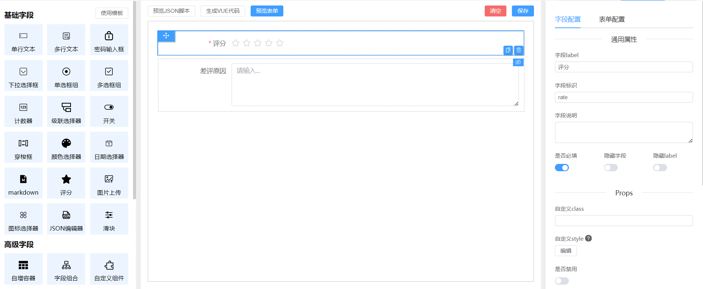

# vue-form-craft

基于 [vue](https://github.com/vuejs/vue) 和 [element-plus](https://github.com/ElemeFE/element) 实现的表单设计器 + 渲染器

使用了最新的前端技术栈，可以让你免去vue项目中表单的烦恼。

- [在线预览](https://xinnian999.github.io/vue-form-craft/form-design)
- [官方文档](https://xinnian999.github.io/vue-form-craft/)
- 作者：Elin
- 联系方式：17803000829



## 特性

- 可视化设计表单
- 支持三十多种的表单组件(el所有表单组件、内置组件)
- 支持收集Array数据（自增组件）
- 用法简单，又非常高效的表单联动
- 可预览生成的json配置
- 可预览生成的VUE组件
- 高扩展性、支持自定义组件、支持各种ui组件库来替换ui
- 支持表单填写校验
- 组件无限深层嵌套，深层校验
- 支持远程获取表单的schema，后台存储表单，前端在线修改

## 第三方插件

- vuedraggable
- element-ui
- json-editor-vue3
- lodash
- md-editor-v3

## 使用

### 版本要求

vue@3.x

### 安装

```js
npm i vue-form-craft
//或
yarn add vue-form-craft
//或
pnpm i vue-form-craft
```

### 全局注册

```js
import { createApp } from 'vue'
import App from './App.vue'
import VueFormCraft from 'vue-form-craft'
const app = createApp(App)

app.use(VueFormCraft)
app.mount('#app')
```

### 使用

> 使用表单设计器

```vue
<template>
  <form-design @onSave="onSave" />
</template>

<script setup>
const onSave = (schema) => {
  console.log(schema)
}
</script>
```

> 使用表单渲染器

```vue
<template>
  <FormRender :schema="schema" footer @onFinish="onFinish" />
</template>

<script setup>
const onFinish = (values) => {
  alert(JSON.stringify(values))
}

const schema = {
  labelWidth: 150,
  labelAlign: 'right',
  size: 'default',
  items: [
    {
      label: '用户名',
      component: 'Input',
      props: {
        placeholder: '请输入用户名'
      },
      designKey: 'form-eNR0',
      name: 'username',
      required: true
    },
    {
      label: '密码',
      component: 'Password',
      props: {
        placeholder: '请输入密码'
      },
      designKey: 'form-D1x7',
      name: 'password',
      required: true
    }
  ]
}
</script>
```
