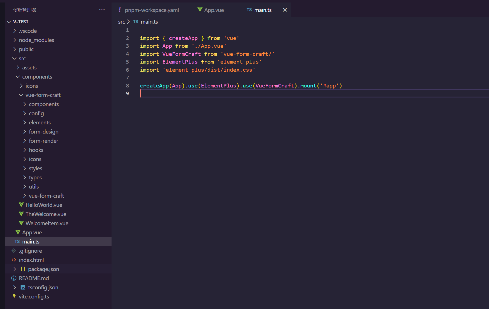

# 二次开发指南

如果你需要更灵活的定制化功能，那么可以选择二次开发本项目。

## 方法一

1、将本项目`clone`下来

2、安装依赖

```sh
pnpm i
```

3、启动项目，将直接启动文档项目，用来**开发且同步预览**

```sh
pnpm dev
```

4、构建项目，生成`dist`目录。 `dist/vue-form-craft.js`就是依赖入口！

```sh
pnpm build
```

## 方法二

1、将本项目的 `src` 目录copy到你项目里的组件目录下。 比如 `src/components`下，并重命名为 `vue-form-craft`


2、引入 `vue-form-craft/release` 到 `main.ts` 里注册即可。



3、`vite.config.ts`增加一条路径别名配置

```ts
import { fileURLToPath, URL } from 'node:url'

import { defineConfig } from 'vite'
import vue from '@vitejs/plugin-vue'
import vueJsx from '@vitejs/plugin-vue-jsx'

// https://vitejs.dev/config/
export default defineConfig({
  plugins: [
    vue(),
    vueJsx(),
  ],
  resolve: {
    alias: {
      '@': fileURLToPath(new URL('./src', import.meta.url)),
      '@vue-form-craft': fileURLToPath(new URL('./src/components/vue-form-craft', import.meta.url))
    }
  }
})

```

4、如果你项目里使用了`TypeScript`，则需要在`tsconfig.json`里也增加一条路径别名配置

```json
{
  "extends": "@vue/tsconfig/tsconfig.dom.json",
  "include": ["env.d.ts", "src/**/*", "src/**/*.vue"],
  "exclude": ["src/**/__tests__/*"],
  "compilerOptions": {
    "composite": true,
    "tsBuildInfoFile": "./node_modules/.tmp/tsconfig.app.tsbuildinfo",
    "types": ["vue-form-craft/global"],
    "baseUrl": ".",
    "paths": {
      "@/*": ["./src/*"],
      "@vue-form-craft/*": ["./src/components/vue-form-craft/*"],
    }
  }
}
```

5、最后，你的项目里还需要安装一些依赖，可以根据报错提示来安装缺少的依赖。

```sh
npm i lodash vuedraggable-es  json-editor-vue3 ... 
```

6、如果出现报错`Uncaught SyntaxError: The requested module '/node_modules/.pnpm/jsoneditor@9.10.5/node_modules/jsoneditor/dist/jsoneditor.min.js?v=3fb8ead3' does not provide an export named 'default' (at json-editor.vue:2:8)`

那么还需要增加依赖`@originjs/vite-plugin-commonjs`。

```ts
import { fileURLToPath, URL } from 'node:url'

import { defineConfig } from 'vite'
import vue from '@vitejs/plugin-vue'
import vueJsx from '@vitejs/plugin-vue-jsx'
import { viteCommonjs } from '@originjs/vite-plugin-commonjs'

// https://vitejs.dev/config/
export default defineConfig({
  plugins: [
    vue(),
    vueJsx(),
    viteCommonjs()
  ],
  resolve: {
    alias: {
      '@': fileURLToPath(new URL('./src', import.meta.url)),
      '@vue-form-craft': fileURLToPath(new URL('./src/components/vue-form-craft', import.meta.url))
    }
  }
})
```
