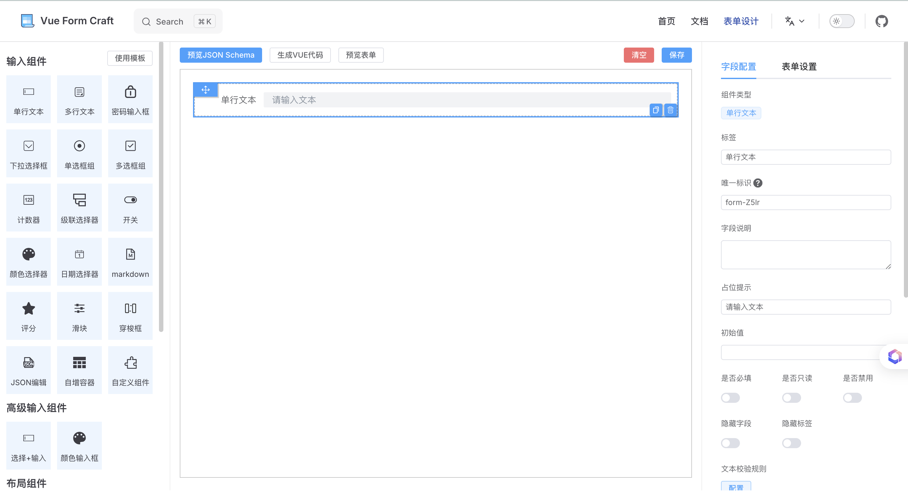

# 扩展其他组件库

可能你的项目用的是其他组件库的组件，那么你也可以选择`vue-form-craft`。因为你可以根据下面的示例，来扩展任意组件库到表单设计器里。

下面以扩展`Arce-design`的`Input`为例

## 创建目录

和上一篇 [例：扩展markdown输入框](/zh/extendMd.html) 差不多，与`/Markdown`同级，创建目录

```
src
└── extendElements
  └── index.ts
  └── Markdown
    └── attrSchema.ts
    └── Component.vue
    └── Icon.vue
    └── index.ts
  └── Transfer 
    └── attrSchema.ts
    └── Icon.vue
    └── index.ts
+ └── AInput 
  + └── attrSchema.ts
  + └── Icon.vue
  + └── index.ts
```


## 封装Icon

在 [阿里iconfont](https://www.iconfont.cn/) 找一个合适的icon ，复制svg代码 ， 写到一个vue文件里即可！

**当然如果你项目里，有封装好的Icon渲染组件，可以直接用，跳过这一步！**

```vue
// src/extendElements/AInput/Icon.vue
<template>
  <svg
    t="1726107434564"
    class="icon"
    viewBox="0 0 1024 1024"
    version="1.1"
    xmlns="http://www.w3.org/2000/svg"
    p-id="3897"
    width="20"
    height="20"
  >
    <path
      d="M854.6 288.6L639.4 73.4c-6-6-14.1-9.4-22.6-9.4H192c-17.7 0-32 14.3-32 32v832c0 17.7 14.3 32 32 32h640c17.7 0 32-14.3 32-32V311.3c0-8.5-3.4-16.7-9.4-22.7zM790.2 326H602V137.8L790.2 326z m1.8 562H232V136h302v216c0 23.2 18.8 42 42 42h216v494z"
      p-id="3898"
    ></path>
    <path
      d="M429 481.2c-1.9-4.4-6.2-7.2-11-7.2h-35c-6.6 0-12 5.4-12 12v272c0 6.6 5.4 12 12 12h27.1c6.6 0 12-5.4 12-12V582.1l66.8 150.2c1.9 4.3 6.2 7.1 11 7.1H524c4.7 0 9-2.8 11-7.1l66.8-150.6V758c0 6.6 5.4 12 12 12H641c6.6 0 12-5.4 12-12V486c0-6.6-5.4-12-12-12h-34.7c-4.8 0-9.1 2.8-11 7.2l-83.1 191-83.2-191z"
      p-id="3899"
    ></path>
  </svg>
</template>

```

## 配置项表单

通过设计器拖拽，制作的表单，将JsonSchema导出使用！

```ts
// src/extendElements/AInput/attrSchema.ts
import type { FormSchema } from 'vue-form-craft'

export default {
  size: 'small',
  labelAlign: 'top',
  items: [
    { label: '标签', component: 'Input', name: 'label' },
    {
      label: '唯一标识',
      component: 'Input',
      name: 'name',
      help: "既是唯一标识，也是数据路径。比如输入【props.name】，数据就会保存为 { props: { name:'xxx' } }"
    },
    { label: '字段说明', component: 'Textarea', name: 'help' },
    {
      label: '占位提示',
      component: 'Input',
      name: 'props.placeholder',
      designKey: 'form-ekRL'
    },
    { label: '初始值', component: 'Input', name: 'initialValue' },
    {
      component: 'Grid',
      children: [
        { label: '是否必填', component: 'Switch', name: 'required' },
        { label: '是否只读', component: 'Switch', name: 'props.readonly' },
        { label: '是否禁用', component: 'Switch', name: 'props.disabled' },
        { label: '隐藏字段', component: 'Switch', name: 'hidden' },
        { label: '隐藏标签', component: 'Switch', name: 'hideLabel' }
      ],
      props: {
        columns: 3,
        'row-gap': 0,
        'column-gap': 20
      },
      designKey: 'form-R003',
      name: 'cNmCuu',
      style: {
        marginBottom: 0
      }
    },
    {
      label: '文本校验规则',
      component: 'FormList',
      name: 'rules',
      dialog: true,
      children: [
        {
          label: '类型',
          component: 'Select',
          props: {
            mode: 'static',
            options: [
              {
                label: '邮箱',
                value: 'email'
              },
              {
                label: '字母+数字',
                value: '^(?=.*[a-zA-Z])(?=.*\\d)[a-zA-Z\\d]+$'
              },
              {
                label: '手机号码',
                value: '^1[3456789]\\d{9}$'
              },
              {
                label: '网址',
                value: 'url'
              },
              {
                label: '自定义正则',
                value: 'custom'
              }
            ],
            placeholder: '请选择...',
            labelKey: 'label',
            valueKey: 'value'
          },
          designKey: 'form-3L0P',
          name: 'type'
        },
        {
          label: '自定义正则',
          component: 'Input',
          props: {
            placeholder: '请输入正则表达式'
          },
          designKey: 'form-Wdb2Reg',
          name: 'customReg',
          hidden: '{{$item.type!=="custom"}}'
        },
        {
          label: '提示语',
          component: 'Input',
          props: {
            placeholder: '请输入...'
          },
          designKey: 'form-Wdb2',
          name: 'message'
        },
        {
          label: '校验时机',
          component: 'Checkbox',
          props: {
            mode: 'static',
            options: [
              {
                label: '失去焦点时',
                value: 'blur'
              },
              {
                label: '输入时',
                value: 'change'
              }
            ],
            placeholder: '请选择...',
            labelKey: 'label',
            valueKey: 'value'
          },
          designKey: 'form-3L0P6666',
          name: 'trigger'
        }
      ],
      designKey: 'form-89tI',
      props: {
        mode: 'card',
        title: '校验规则'
      }
    },
    { label: '显示清除按钮', component: 'Switch', name: 'props.clearable' },
    {
      label: '最长字数',
      component: 'InputNumber',
      name: 'props.maxlength'
    },
    

  ]
} satisfies FormSchema
```

## 总配置

上面的几个文件，合并成一个`FormElement`对象，也就是一个完整的扩展组件！

> 这里可以直接使用`Arco`的`Input` 作为渲染组件，无需二次封装


```ts
// src/extendElements/Transfer/index.ts
import type { FormElement } from 'vue-form-craft'
import icon from './Icon.vue'
import attrSchema from './attrSchema'
import { Input } from "@arco-design/web-vue";

export default {
  name: '单行文本',
  component: Input,
  icon,
  type: 'basic',
  order: 1,
  initialValues: {
    label: '单行文本',
    component: 'AInput', // A开头是为了和内置的Input做区分
    props: {
      placeholder: '请输入文本'
    }
  },
  attrSchema
} satisfies FormElement
```

## 导出，使用

```ts
// src/extendElements/index.ts
import Markdown from './Markdown'
import Transfer from './Transfer'
import AInput from './AInput'

export default {
    Markdown,
    Transfer,
    AInput
}
```

```ts
// main.ts
import { createApp } from 'vue'
import App from './App.vue'
import ElementPlus from 'element-plus'
import 'element-plus/dist/index.css'
import ArcoVue from '@arco-design/web-vue';
import '@arco-design/web-vue/dist/arco.css';
import VueFormCraft from 'vue-form-craft'
import extendElements from './extendElements'

const app = createApp(App)

app.use(ElementPlus)
app.use(ArcoVue)
app.use(VueFormCraft, { extendElements })
app.mount('#app')

```


最后，将`element-plus`的`Input`隐藏掉

```vue
<template>
  <div style="width:100vw;height:100vh">
    <FormDesign :omit="['Input']" />
  </div>
</template>
```


